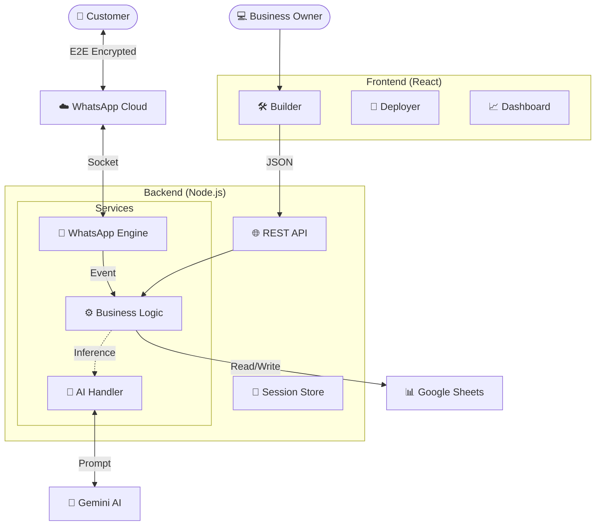

# 🌊 AutoFlow: Autonomous WhatsApp Agent Builder

**Build. Visualize. Deploy.**  
The professional platform for building AI-driven WhatsApp agents with visual workflows and real-time inventory sync.


---

## 💡 Overview

**AutoFlow** is a comprehensive solution for businesses looking to automate customer interaction on WhatsApp. Unlike simple chatbots, AutoFlow agents are:

*   **Context-Aware**: They remember conversation history.
*   **Data-Connected**: They read/write to your Google Sheets inventory in real-time.
*   **Visual**: Built using a drag-and-drop node editor, generated instantly by AI.

> *"I need an agent for my bakery that handles cake orders and checks flavor availability."*  
> ↳ **AutoFlow builds the flows, connects the database, and deploys the agent.**

---

## ✨ Core Features

### 🛠️ No-Code Logic Builder
*   **Text-to-Flow**: Generate complex workflows from simple prompts.
*   **Drag & Drop**: Edit nodes using ReactFlow.
*   **Live Test**: Simulate conversations before deploying.

### 📱 Enterprise Deployment
*   **QR Authentication**: Secure, instance-based login.
*   **Auto-Healing**: Automatic session recovery and reconnection.
*   **Multi-Session**: Handle high-volume traffic.

### 📊 Intelligence Dashboard
*   **ROI Tracking**: Visualize time and cost savings.
*   **Sentiment Analysis**: Monitor user satisfaction.
*   **Inventory Sync**: Two-way sync with Google Sheets.

### 🧠 Hybrid Engine
*   **Gemini Pro**: Handles complex natural language understanding.
*   **Rule Engine**: Executes deterministic business logic (Refudns, Order Status).

---

## 🎨 System Architecture

AutoFlow employs a **Microservices-inspired architecture**. The frontend communicates with the backend via REST, while the backend maintains a persistent WebSocket connection to WhatsApp servers.



---

## 🚀 Quick Start

### 1️⃣ Prerequisites
*   **Node.js** v18 or higher
*   **Google Cloud Console** Account (Enabled Sheets API & Gemini API)

### 2️⃣ Installation
Clone the repository and install dependencies for both services.

```bash
# Clone Repo
git clone https://github.com/yourusername/autoflow.git

# Install Backend
cd autoflow/autoflow-backend
npm install

# Install Frontend
cd ../autoflow-frontend
npm install
```

### 3️⃣ Configuration
Create a `.env` file in `autoflow-backend/`:

```env
PORT=3000
# Get this from Google AI Studio
GEMINI_API_KEY=AIzaSy... 
# ID of your Google Sheet
GOOGLE_SHEET_ID=1xYz...
# Path to your service account json
GOOGLE_APPLICATION_CREDENTIALS=./credentials.json
```

### 4️⃣ Launch

```bash
# Terminal 1: Backend
cd autoflow-backend && npm start

# Terminal 2: Frontend
cd autoflow-frontend && npm run dev
```

Visit **`http://localhost:5173`** to access the dashboard.

---

## 📝 API Reference

<details>
<summary><b>📲 WhatsApp Endpoints (Click to Expand)</b></summary>

| Method | Endpoint | Description |
| :--- | :--- | :--- |
| `POST` | `/api/whatsapp/deploy` | Initializes the session and returns a QR code stream. |
| `GET` | `/api/whatsapp/status` | Returns connection status (`connected`, `scanning`, `disconnected`). |
| `POST` | `/api/whatsapp/logout` | Destroys the current session and clears filesystem auth. |

</details>

<details>
<summary><b>🧠 Workflow & AI Endpoints</b></summary>

| Method | Endpoint | Description |
| :--- | :--- | :--- |
| `POST` | `/api/generate-workflow` | Accepts a natural language prompt and returns a JSON workflow. |
| `POST` | `/api/simulate-message` | Sends a mock message to the engine for testing without WhatsApp. |

</details>

<details>
<summary><b>📊 Data & Sheets Endpoints</b></summary>

| Method | Endpoint | Description |
| :--- | :--- | :--- |
| `GET` | `/api/sheets/inventory` | Syncs and returns current stock levels. |
| `POST` | `/api/sheets/order` | Logs a new order row to the configured Sheet. |

</details>

---

## 📂 Project Structure

```bash
AutoFlow/
├── 📂 assets/                 # Project assets
│
├── 📂 autoflow-frontend/      # React Client (Vite)
│   ├── 📂 public/
│   │   ├── logo.png
│   │   └── vite.svg
│   ├── 📂 src/
│   │   ├── 📂 assets/
│   │   ├── 📂 components/     # Reusable UI Components
│   │   ├── 📂 constants/      # App Constants
│   │   ├── 📂 data/           # Static Data
│   │   ├── 📂 hooks/          # Custom React Hooks
│   │   ├── 📂 pages/          # Page Components
│   │   │   ├── Builder.jsx    # visual Workflow Builder
│   │   │   ├── Dashboard.jsx  # Analytics Dashboard
│   │   │   └── DeployPage.jsx # WhatsApp QR Deployment
│   │   ├── 📂 services/       # API Services (Axios)
│   │   ├── 📂 styles/         # Global Styles
│   │   ├── App.jsx            # Main App Component
│   │   └── main.jsx           # Entry Point
│   ├── 📄 index.html
│   ├── 📄 tailwind.config.js
│   └── 📄 vite.config.js
│
├── 📂 autoflow-backend/       # Node.js Server
│   ├── 📂 auth_info_baileys/  # WhatsApp Session Data (Generated)
│   ├── 📂 src/
│   │   ├── 📂 config/         # App Config
│   │   ├── 📂 controllers/    # Request Handlers
│   │   ├── 📂 routes/         # API Route Definitions
│   │   ├── 📂 services/       # Business Logic
│   │   │   ├── ai.service.js          # Gemini Integration
│   │   │   ├── engine.service.js      # Core Logic Engine
│   │   │   ├── googleSheet.service.js # Sheets API
│   │   │   └── whatsapp.service.js    # Baileys Socket
│   │   └── app.js             # Express App Setup
│   ├── 📂 uploads/            # File Uploads
│   ├── 📄 server.js           # Server Entry Point
│   ├── 📄 credentials.json    # Google Service Account Key
│   └── 📄 verify_orders_tab.js
│
├── 📂 landing/                # Static Landing Page
│   ├── index.html
│   ├── script.js
│   └── styles.css
│
└── 📄 README.md               # Documentation
```

---

## 🔧 Troubleshooting

<details>
<summary><b>❓ QR Code Not Generating</b></summary>

*   **Cause**: A session might already be hung in the background.
*   **Fix**: Click the "Force Logout" button in the UI or manually delete the `autoflow-backend/auth_info_baileys` folder and restart the server.

</details>

<details>
<summary><b>❓ Google Sheets 403 Error</b></summary>

*   **Cause**: The Service Account email has not been invited to edit the Sheet.
*   **Fix**: Copy the `client_email` from `credentials.json` and share your Google Sheet with that email as an **Editor**.

</details>

<details>
<summary><b>❓ AI Not Responding</b></summary>

*   **Cause**: API Key quota exceeded or invalid key.
*   **Fix**: Check your `GEMINI_API_KEY` in `.env`. Ensure billing is enabled if using Pro models heavily.

</details>
