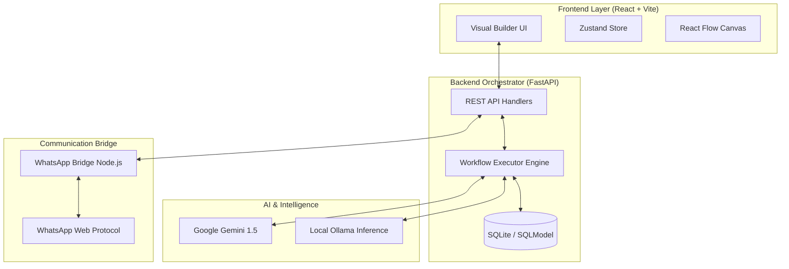
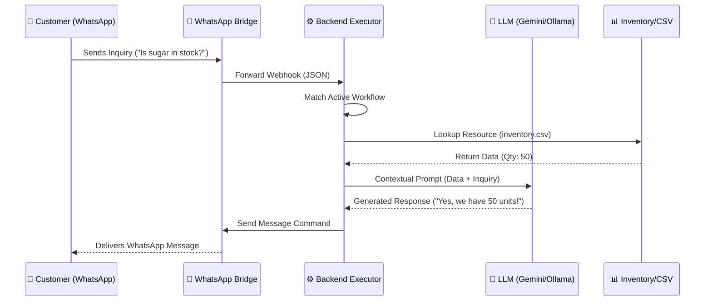

# ⚡ AutoFlow AI: The Intelligent Agentic Ecosystem

[](https://opensource.org/licenses/MIT)
[](https://fastapi.tiangolo.com/)
[](https://reactjs.org/)
[](https://github.com/pedroslopez/whatsapp-web.js/)
[](https://ai.google.dev/)

**AutoFlow AI** is a professional, low-code platform designed to build, visualize, and deploy autonomous AI agents. By combining a futuristic visual builder with a robust multi-service architecture, AutoFlow enables anyone to create complex automation workflows powered by Google Gemini and local LLMs (via Ollama).

---

## 🌟 Key Features

- **🧠 Hybrid AI Intelligence**: Seamlessly switch between **Google Gemini 1.5 Pro** for cloud power and **Ollama (Qwen3:8B)** for local, private inference.
- **🎨 Professional Visual Builder**: An infinite-canvas editor built with React Flow, featuring agent-centric topology and dynamic Bezier connections.
- **🔌 Multi-Channel Connectivity**: Native bridge for **WhatsApp**, with upcoming support for Slack, Gmail, and Salesforce.
- **📊 Real-Time Analytics**: Built-in ROI dashboard and audit logs to track agent performance and decision-making history.
- **🛠️ Tech-Mode Customization**: Toggle between simple AI generation and advanced manual editing for granular control over tool nodes.
- **📦 Data-Driven Actions**: Integrated CSV/Spreadsheet support for inventory lookups, payment logging, and automated broadcasting.

---

## 🏗️ System Architecture

AutoFlow is built on a high-performance microservice architecture, ensuring scalability and ease of deployment.


```mermaid
graph TB
    subgraph "Frontend Layer (React + Vite)"
        UI[Visual Builder UI]
        State[Zustand Store]
        Flow[React Flow Canvas]
    end

    subgraph "Backend Orchestrator (FastAPI)"
        API[REST API Handlers]
        Executor[Workflow Executor Engine]
        DB[(SQLite / SQLModel)]
    end

    subgraph "AI & Intelligence"
        Gemini[Google Gemini 1.5]
        Ollama[Local Ollama Inference]
    end

    subgraph "Communication Bridge"
        WA_Bridge[WhatsApp Bridge Node.js]
        WA_Web[WhatsApp Web Protocol]
    end

    %% Connections
    UI <--> API
    API <--> Executor
    Executor <--> DB
    Executor <--> Gemini
    Executor <--> Ollama
    API <--> WA_Bridge
    WA_Bridge <--> WA_Web
```

---

## 🔄 Agentic Workflow

The following diagram illustrates how messages are processed through the AutoFlow ecosystem:


```mermaid
sequenceDiagram
    participant User as 👤 Customer (WhatsApp)
    participant Bridge as 🔌 WhatsApp Bridge
    participant Backend as ⚙️ Backend Executor
    participant AI as 🧠 LLM (Gemini/Ollama)
    participant Data as 📊 Inventory/CSV

    User->>Bridge: Sends Inquiry ("Is sugar in stock?")
    Bridge->>Backend: Forward Webhook (JSON)
    Backend->>Backend: Match Active Workflow
    Backend->>Data: Lookup Resource (inventory.csv)
    Data-->>Backend: Return Data (Qty: 50)
    Backend->>AI: Contextual Prompt (Data + Inquiry)
    AI-->>Backend: Generated Response ("Yes, we have 50 units!")
    Backend->>Bridge: Send Message Command
    Bridge-->>User: Delivers WhatsApp Message
```

---

## 🛠️ Technology Stack

| Component | Technology |
| :--- | :--- |
| **Frontend** | React 18, Vite, TailwindCSS, React Flow, Zustand, Recharts |
| **Backend** | Python 3.11, FastAPI, SQLModel, Uvicorn |
| **Bridges** | Node.js, Express, WhatsApp-Web.js (Puppeteer) |
| **Database** | SQLite (Production-ready via SQLModel) |
| **AI/ML** | Google Gemini API, Ollama (Local LLM) |
| **Deployment** | Docker, Docker Compose |

---

## 📂 Project Structure

```text
AutoFlow/
├── autoflow-frontend/     # React + Vite Visual Builder
│   ├── src/               # UI Components & State Management
│   └── public/            # Static Assets
├── backend/               # FastAPI Orchestrator
│   ├── routers/           # API Endpoints
│   ├── executor.py        # Workflow Traversal Engine
│   └── models.py          # Database Schemas
├── whatsapp-bridge/       # Node.js WhatsApp WebSocket Bridge
│   ├── server.js          # Express Webhook Handler
│   └── session/           # WhatsApp Auth States
├── data/                  # Persistent SQLite DB & CSV Resources
└── docker-compose.yml     # Multi-service Orchestration
```

---

## 🚀 Quick Start

### 1. Prerequisites
- Docker & Docker Compose
- Google AI Studio API Key (Optional, for Gemini support)

### 2. Environment Setup
Create a `.env` file in the root directory:
```env
GEMINI_API_KEY=your_key_here
WHATSAPP_PORT=3001
BACKEND_PORT=8000
```

### 3. Launch the Ecosystem
```bash
docker-compose up --build
```
- **Builder UI**: `http://localhost:3000`
- **Backend API**: `http://localhost:8000`
- **WhatsApp Bridge**: `http://localhost:3001`

---

## 🤝 Contributing

We welcome contributions! Please fork the repository and submit a pull request for any features or bug fixes.

1. Fork the Project
2. Create your Feature Branch (`git checkout -b feature/AmazingFeature`)
3. Commit your Changes (`git commit -m 'Add some AmazingFeature'`)
4. Push to the Branch (`git push origin feature/AmazingFeature`)
5. Open a Pull Request

---

## 📄 License

Distributed under the MIT License. See `LICENSE` for more information.

<p align="center">
  Built with ❤️ by the AutoFlow Team
</p>
