# 🔄 AutoFlow: Message Processing Workflow

This document visualizes the complete lifecycle of a message within the AutoFlow system, from the user's phone to the final response.

## 🧩 High-Level Flow

1.  **User** sends a message via WhatsApp.
2.  **Baileys** (via WebSocket) receives and decrypts the payload.
3.  **Logic Engine** sanitizes the input and detects intent.
4.  **Routing**:
    *   **Simple Intents** (Greetings, Menu) are handled locally.
    *   **Data Intents** (Price, Stock) query **Google Sheets**.
    *   **Complex Intents** are forwarded to **Gemini AI**.
5.  **Response** is formatted and sent back to the user.

---

## 📐 Detailed Workflow Diagram

```mermaid
graph TD
    %% STYLES
    classDef user fill:#E5F4FD,stroke:#3B82F6,stroke-width:2px,color:#1e3a8a;
    classDef whatsapp fill:#DCFCE7,stroke:#22C55E,stroke-width:2px,color:#14532d;
    classDef engine fill:#F3E8FF,stroke:#A855F7,stroke-width:2px,color:#581c87;
    classDef sheets fill:#FEF3C7,stroke:#F59E0B,stroke-width:2px,color:#78350f;
    classDef ai fill:#FCE7F3,stroke:#EC4899,stroke-width:2px,color:#831843;

    %% EXTERNAL
    User((👤 User Phone)):::user
    WAServer[☁️ WhatsApp Cloud]:::whatsapp

    %% BACKEND CONTEXT
    subgraph Processing_System ["⚡ AutoFlow Processing System"]
        direction TB
        
        Baileys[🔌 Baileys Socket Service]:::whatsapp
        
        subgraph Engine_Core ["⚙️ Logic Engine Core"]
            Decrypt[🔓 Decrypt & Parse]:::engine
            PreProcess[🧹 Sanitize & Normalization]:::engine
            Router{🚦 Intent Router}:::engine
        end

        subgraph Handlers ["🛠️ Action Handlers"]
            H_Static[📝 Static Response]:::engine
            H_Sheet[📊 Sheet Service]:::sheets
            H_AI[🧠 AI Service]:::ai
        end

        ResponseBuilder[✉️ Response Formatter]:::engine
    end

    %% EXTERNAL DATA
    GSheets[(Google Sheets DB)]:::sheets
    GeminiAPI[✨ Gemini Pro API]:::ai

    %% CONNECTIONS & LOGIC FLOW
    User -->|1. Sends Msg| WAServer
    WAServer -->|2. WebSocket Push| Baileys
    Baileys -->|3. Event: messages.upsert| Decrypt
    Decrypt -->|4. Clean Text| PreProcess
    PreProcess -->|5. Analyzed Text| Router

    %% ROUTING LOGIC
    Router -->|'Hi', 'Menu'| H_Static
    Router -->|'Price', 'Stock'| H_Sheet
    Router -->|'Order', 'Buy'| H_Sheet
    Router -->|Unmatched/Complex| H_AI

    %% HANDLER EXECUTION
    H_Static -->|Get Template| ResponseBuilder
    
    H_Sheet -->|6a. Read/Write| GSheets
    GSheets -->|6b. Data Return| H_Sheet
    H_Sheet -->|Format Data| ResponseBuilder

    H_AI -->|7a. Prompt + Context| GeminiAPI
    GeminiAPI -->|7b. Generated Text| H_AI
    H_AI -->|Natural Response| ResponseBuilder

    %% FINAL REPLY
    ResponseBuilder -->|8. Final Payload| Baileys
    Baileys -->|9. Send Message| WAServer
    WAServer -->|10. Delivers| User
```

---

## 📌 Key Components

| Component | Responsibility | Tech Stack |
| :--- | :--- | :--- |
| **Baileys Socket** | Manages the persistent WebSocket connection, auth, and encryption. | `@whiskeysockets/baileys` |
| **Intent Router** | Regex-based classification for high-speed routing (0ms latency). | JavaScript `RegExp` |
| **Sheet Service** | Acts as a pseudo-database for inventory and logging. | `google-spreadsheet` |
| **AI Service** | Handles fallback and complex conversational queries. | `@google/generative-ai` |
